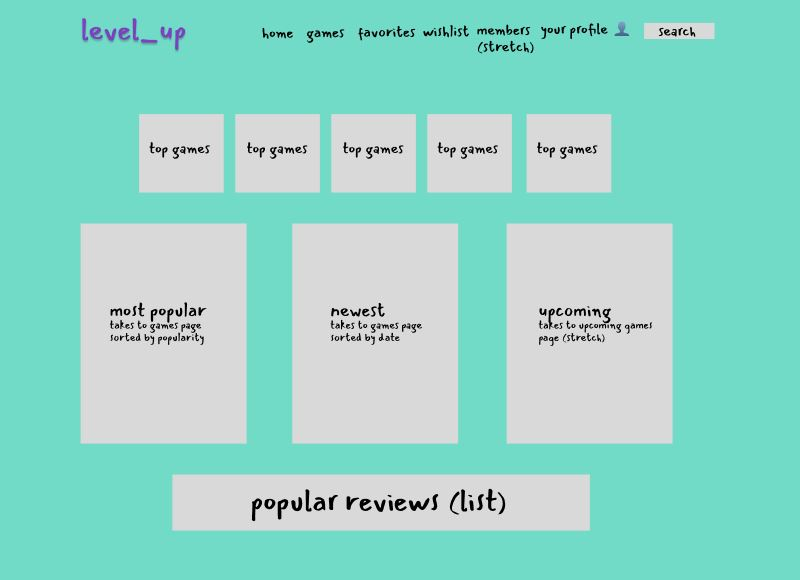
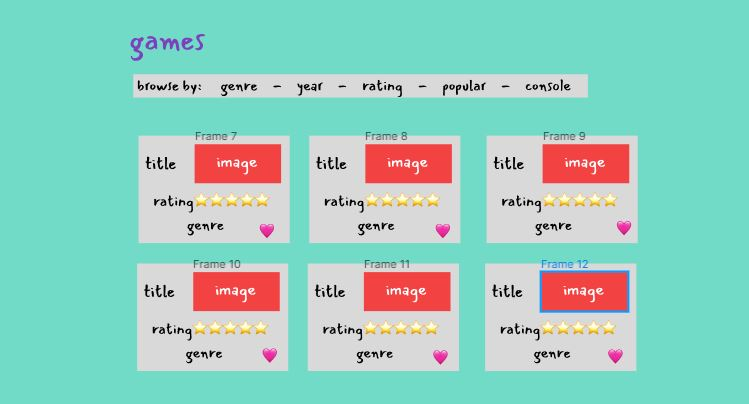
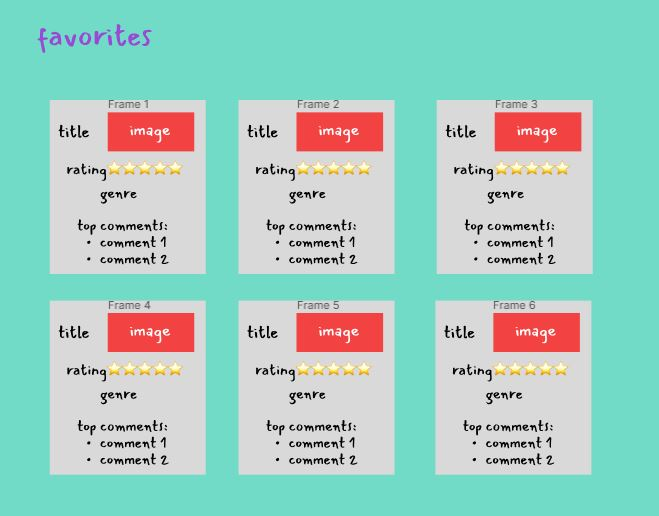
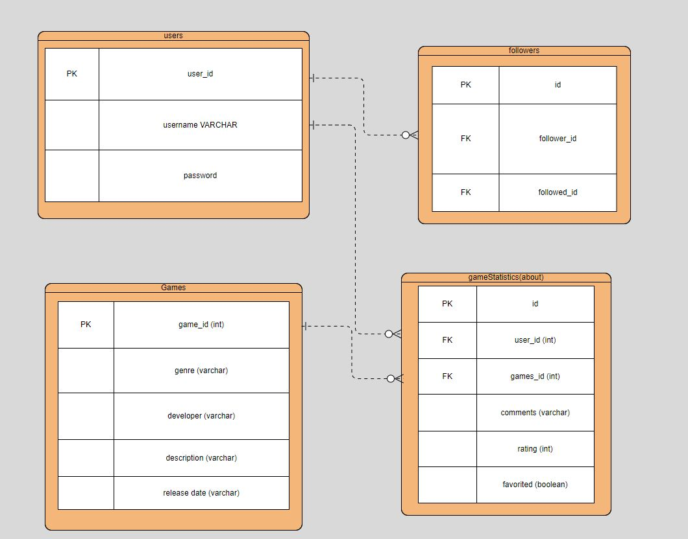
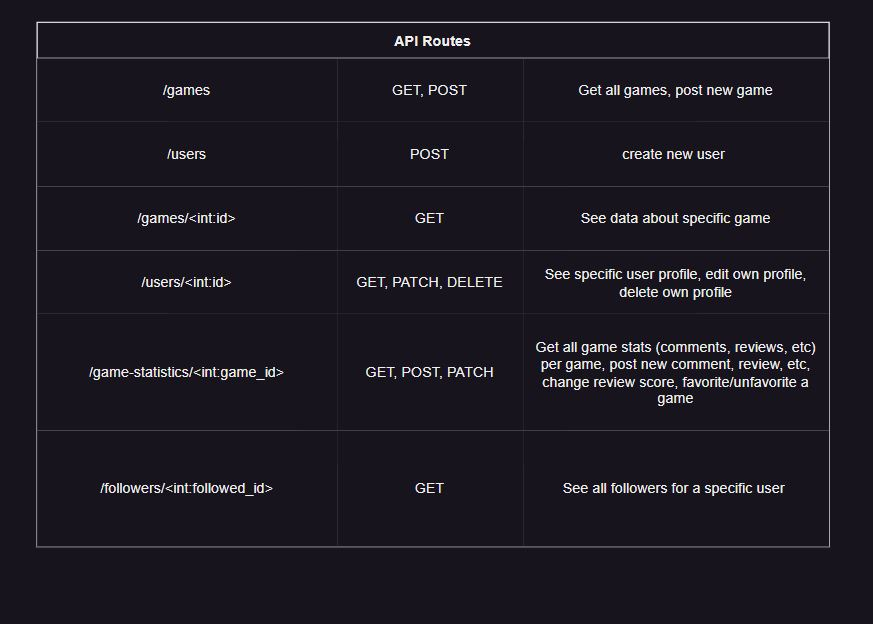
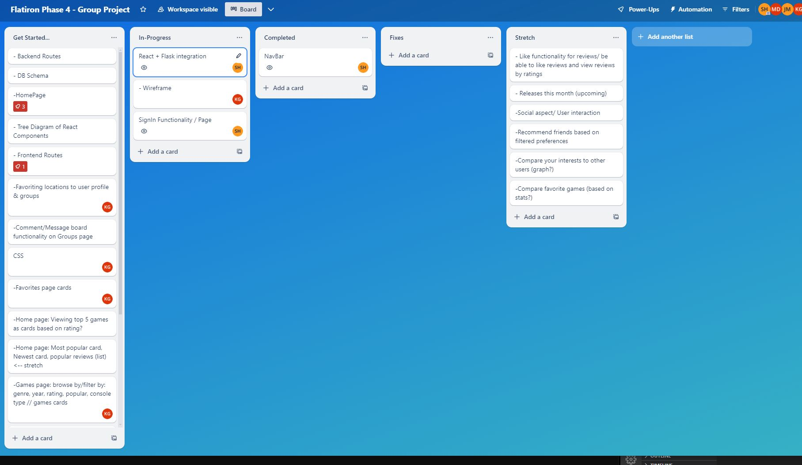

# Gamespace

Comprehensive social network platform designed for game lovers, named "Gamespace." Below is a detailed breakdown of the project's components, features, and development plans, formatted in Markdown for clarity and visual appeal.

## Overview of Gamespace
Gamespace is a social network tailored for gamers that includes a variety of features to enhance user interaction and game discovery. It aims to provide a rich user experience by allowing gamers to list, filter, rate, and discuss their favorite games.

## Core Features
* List of Games: A comprehensive database of games that users can browse.
* Filterable: Users can filter games based on genre, release date, popularity, etc.
* User Login: Secure login functionality for personalized experiences.
* Comments: Users can comment on games and discussions.
* Rate Games: Users can rate games on a scale, influencing the game's popularity and recommendations.
* Most Played Genre: The platform will highlight the most played genres.
* Top Games: A regularly updated list of top-rated and most-discussed games.

## Advanced Features (Stretch Goals)
* Releases This Month: A feature to highlight games released in the current month.
* Social Interaction: Enhanced user interaction features, such as messaging and forums.
* Recommend Friends: Suggest friends to users based on their game preferences and activity.
* Compare Interests: Users can compare their game interests with others to find gaming partners.
* Add Your Own Game: Developers can add their games to the database for user reviews and exposure.

## Wireframe
The wireframes provide a visual guide for the layout and structure of the Gamespace platform:

## React Routes
Visual representation of the React routing structure for the application:

## React Component Tree
Diagram showing the hierarchy and relationship between React components:

## Database Schema
The database schema outlines the relationships between different data models:

## API Routes

## Trello
The Trello board link for task management and collaboration:

https://trello.com/b/PZhjos8k/flatiron-phase-4-group-project

## Collaborators
* Kristen Grace 🔗[GitHub Profile Link](https://github.com/kgrace61) 🔗 [LinkedIn Link](www.linkedin.com/in/kristengrace61)
* Shukri Hussein 🔗[GitHub Profile Link](https://github.com/scmh001) 🔗 [LinkedIn Link](https://www.linkedin.com/in/shukrihussein/)
* Jasen Miyamoto 🔗[GitHub Profile Link](https://github.com/jasentm) 🔗[LinkedIn Link](https://www.linkedin.com/in/jasen-miyamoto-ba2619284/)
* Michael DiPasquale 🔗[GitHub Profile Link](https://github.com/mdipasqu13) 🔗[LinkedIn Link](https://www.linkedin.com/in/michael-dipasquale313/)
